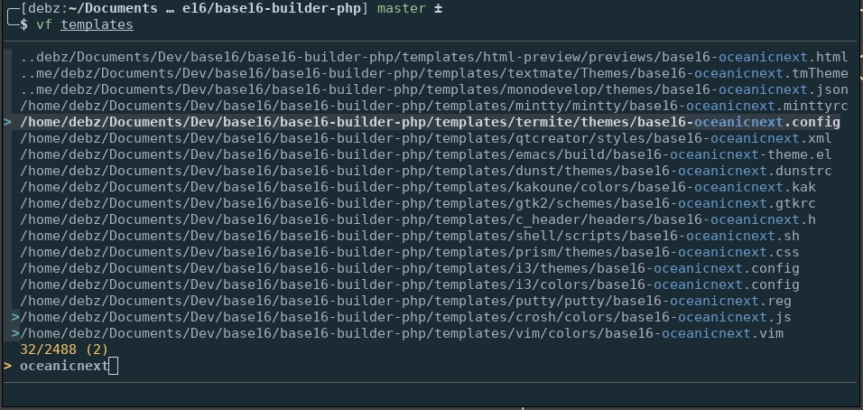
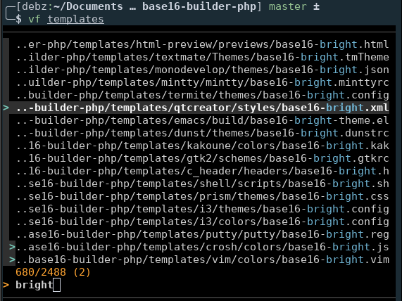
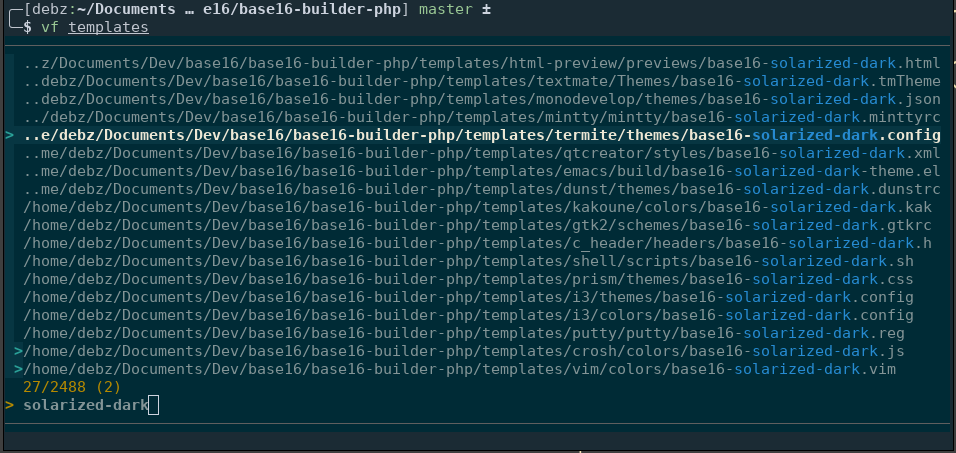
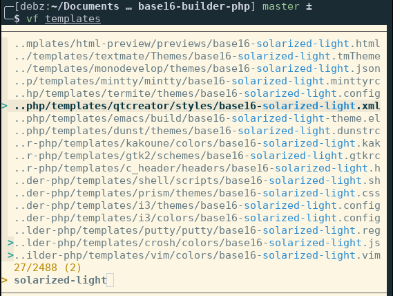

# base16-fzf

## base16-fzf

This repository provide [base16][1] colorschemes for [fzf][2], a command-line
fuzzy finder written in go.

It is meant to be used along with the [new implementation][3] of base16
colorscheme project, which propose a modular approach, by separating templates,
schemes and builder into different repositories.

The `build_scheme` directory of this repository contains fzf colorschemes build
using the [base16-builder-php][4]. You can build all the colorschemes yourself
by using the aformentionned builder or a builder written in another language.
(see [base16 main repository][3])

## Installation

### Bash/Zsh

Append your favorite base16 colorscheme from the `bash` directory into your
{bash,zsh} configuration file.

### Fish

Source your favorite base16 colorscheme from the `fish` directory with the `source` command. This creates a global variable that will be persistent across shell sessions.

## Screenshot

### Oceanicnext

### Bright

### Solarized-dark

### Solarized-light

[1]: https://chriskempson.github.io/base16/
[2]: https://github.com/junegunn/fzf
[3]: https://github.com/chriskempson/base16
[4]: https://github.com/chriskempson/base16-builder-php
